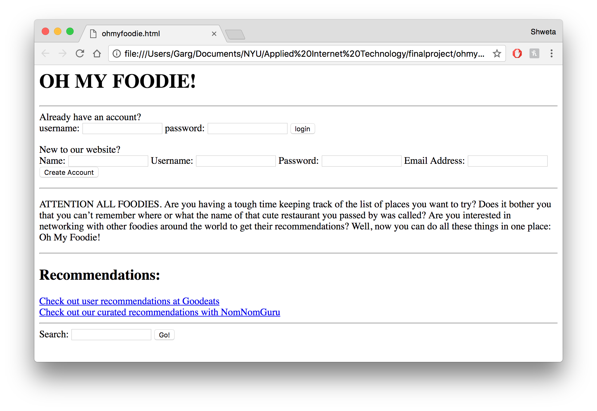
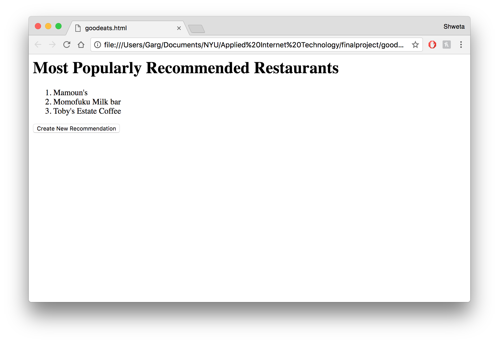
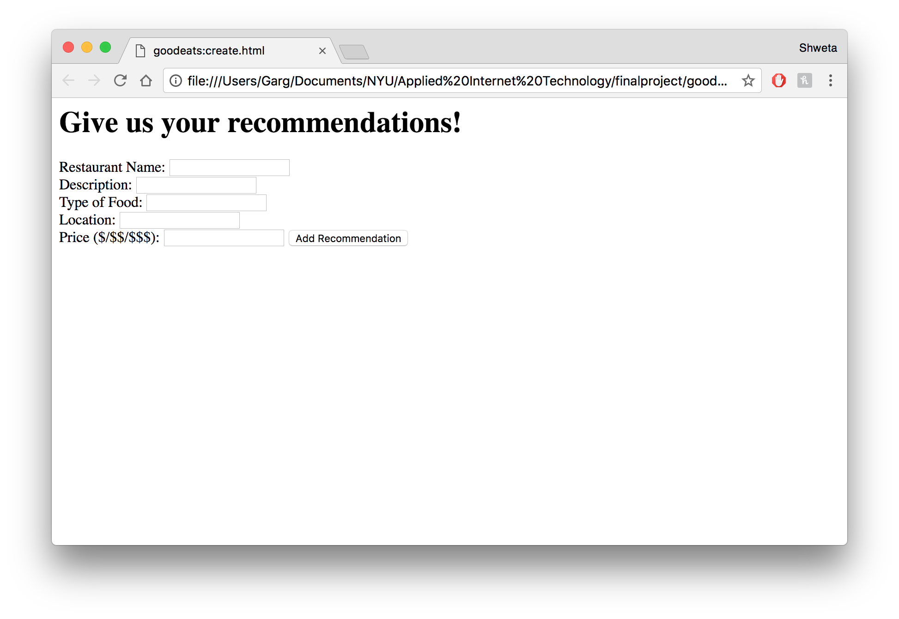
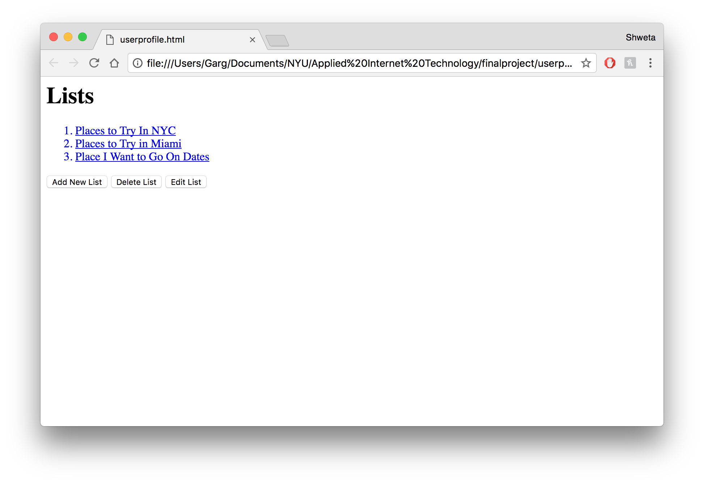
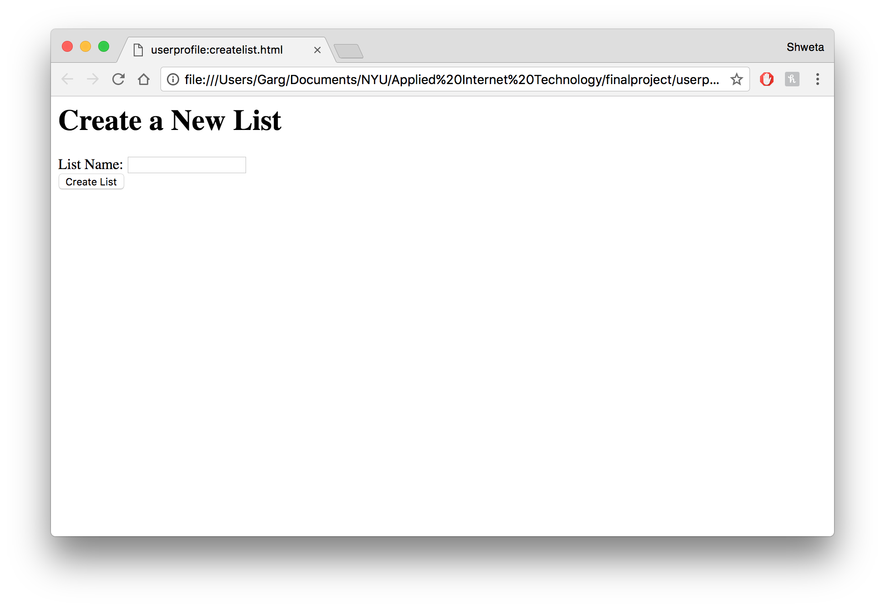
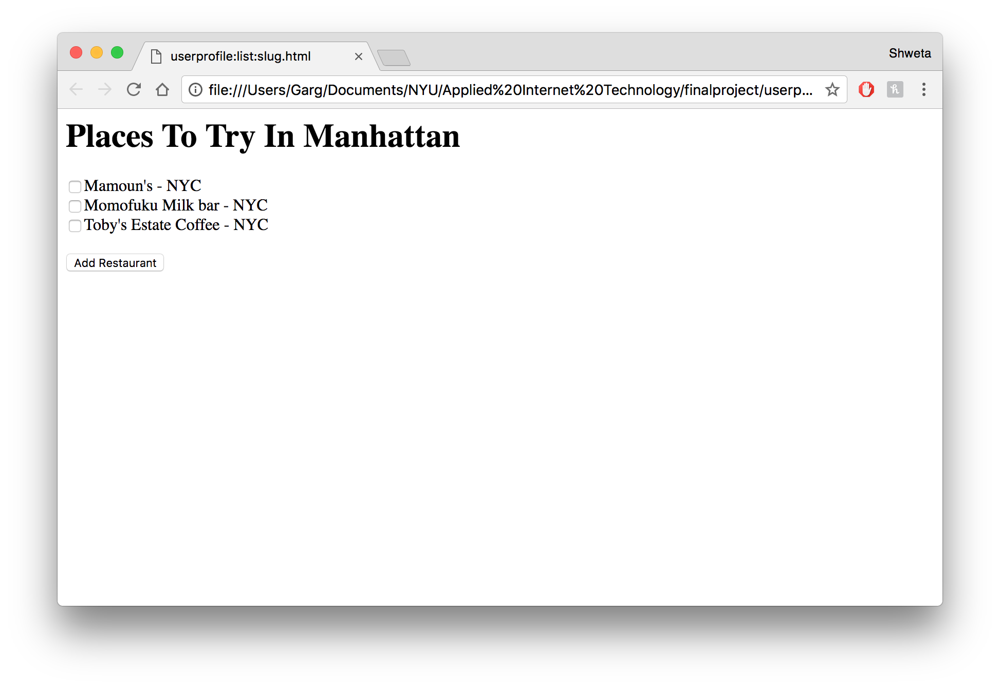
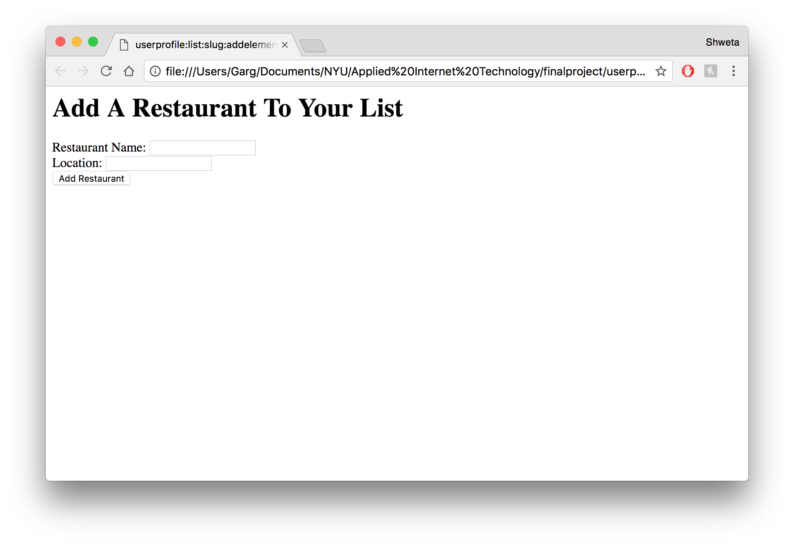
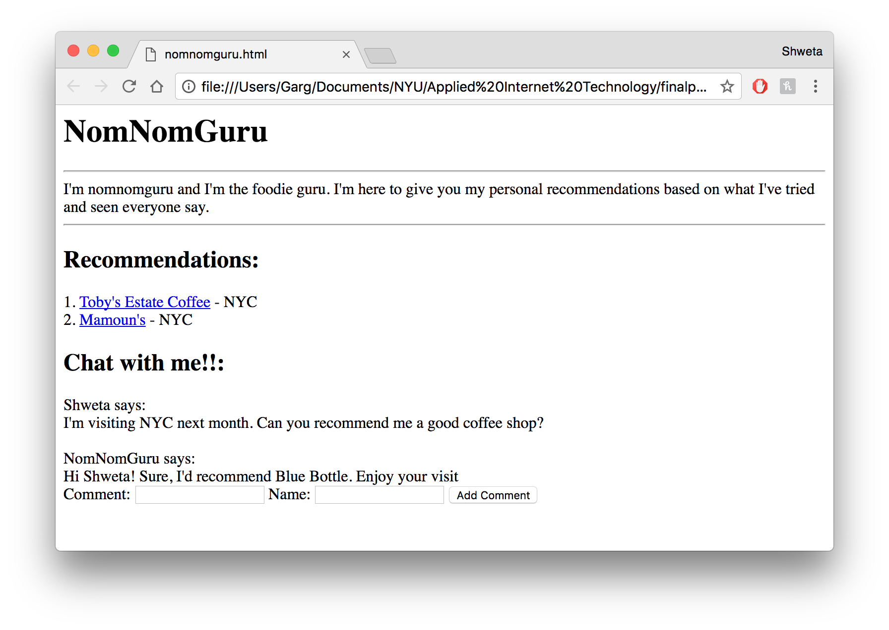
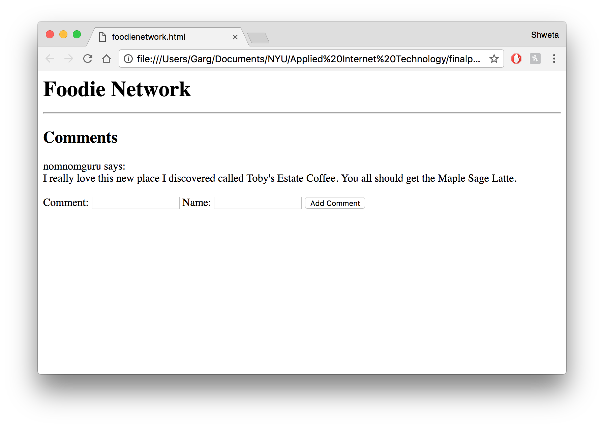
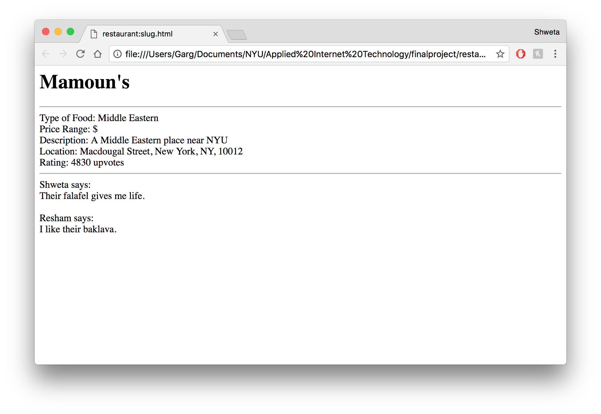

# Oh My Foodie! 

## Overview

ATTENTION ALL FOODIES. Are you having a tough time keeping track of the list of places you want to try? Does it bother you that you can’t remember where or what the name of that cute restaurant you passed by was called? Are you interested in networking with other foodies around the world to get their recommendations? Well, now you can do all these things in one place: Oh My Foodie!

Oh My Foodie (OMF!) is a web app that allows users to create a profile and keep track of multiple lists of places they want to try/have tried. They can register and login. After logging in, they can create or view their lists and add places to them. Users can receive recommendations from our very own NomNomGuru. If there’s a restaurant users love and want the world to know about, they can add it to the app. Or if they simply want to connect with foodies around the world, they can chat via our Foodie Network. 


## Data Model

The application will store Users, Lists, Locations, Comments, and Restaurants

* users can have multiple lists (via references)
* each list can have multiple items (by embedding)
* each restaurant can have user comments associated with it


An Example User:

```javascript
{
  user_fullname: "Guru",
	username: "nomnomguru"
	hash: // a password hash,
	email: nomnomguru@gmail.com,
	lists: // an array of references to List documents
}
```

An Example List with Embedded Restaurants:

```javascript
{
  user: // a reference to a User object
	name: "Restaurants in Manhattan",
	restaurants: [
		{ name: "Mamoun’s", visited: false},
		{ name: "Momofuku Milk Bar", visited: true},
	],
	done: false,
	createdAt: // timestamp
}
```
An Example Restaurants:

```javascript
{
  name: "Mamoun's",
	description: "if you're in the nyu area, you have to go to the middle eastern inspired hole in the wall",
	type: ["Middle Eastern", "hole in the wall"],
	location: // reference to Location object,
	pricerange: "$",
	upvotes: 207,
	comments: // embedded Comments
}
```
An Example Location:

```javascript
{
	name: // reference to restaurant object,
	street: "119 MacDougal St",
	unit: "",
	city: "New York",
	state: "NY",
	zipcode: "10012",
	country: "United States"
}
```
An Example Comments:

```javascript
{
	user: // reference to User object
	comment: "I love getting the falafel here!!"
  createdAt: // timestamp
}
```


## [Link to Commented First Draft Schema](db.js) 

https://github.com/nyu-csci-ua-0480-008-spring-2017/rae296-sg3688-final-project/blob/master/db.js

## Wireframes

ohmyfoodie.com/ - homepage with login or create account, as well as a search bar



/goodeats - a page with recommendations based on popularity and allows upvoting



/goodeats/create - a form for creating a recommendation



/userprofile - a page with the users lists



/userprofile/createlist - a form for creating a new list



/userprofile/list/:slug - a unique page for a specific list



/userprofile/list/:slug/addelement



/nomnomguru - a page with curated recommendations and a contact page



/foodienetwork - a page that functions like a chatroom



/restaurant/:slug - a unique page for a specific restaurant



## Site map

Each page will link to the homepage as well as the userprofile

* / - links to:
	* /goodeats
	* /nomnomguru
	* /restaurant/:slug
	
* /goodeats - links to:
	* /goodeats/create
	
* /goodeats/create - links to:
	* /goodeats
	
* /userprofile - links to:
	* /userprofile/createlist
	* /userprofile/list/:slug
	* /goodeats
	* /foodienetwork
	* /nomnomguru
	
* /userprofile/createlist - links to:
	* /userprofile/list/:slug
	
* /userprofile/list/:slug - links to:
	* /userprofile/list
	* /userprofile/list/:slug/addelement
	
* /userprofile/list/:slug/addelement - links to:
	* /userprofile/list/:slug
	
* /nomnomguru - links to:
	* /restaurant/:slug

## User Stories or Use Cases

1. as non-registered user, I can register a new account with the site
2. as a non-registered user, I can search for a restaurant
3. as a non-registered user, I can interact with nomnomguru
4. as a user, I can log in to the site
5. as a user, I can create a new restaurant list
6. as a user, I can view all of the restaurant lists I've created in a single list
7. as a user, I can add items to an existing restaurant list
8. as a user, I can remove items from an existing restaurant list
9. as a user I can delete an existing list
10. as a user, I can chat with other users
11. as a user, I can create a recommendation for a restaurant
12. as a user, I can upvote a specific restaurant
13. as a user, I can search for a restaurant (and filter)
14. as a user, I can add a restaurant if it does not already exist in the database
15. as a user, I can interact with nomnomguru


## Research Topics

* (7 points) Integrate user authentication
	* Implement sign-up and registration
	* Implement sign-in with a provider such as FB
* (1 point) Per external API
	* Google maps
* (3 points) Configuration management
	* nconf
* (3 points) Unit testing with JavaScript
	* Mocha
* (3 points) Use grunt, gulp, webpack or even make (!) to automate any of the following … must be used in combination with one or more of the other requirements, such as:
	* (2 points) Use a CSS preprocessor
		* Sass

## [Link to Initial Main Project File](app.js) 

https://github.com/nyu-csci-ua-0480-008-spring-2017/rae296-sg3688-final-project/blob/master/app.js

## Annotations / References Used


1. [passport.js authentication docs](http://passportjs.org/docs)
2. [tutorial on adding google maps with a marker](https://developers.google.com/maps/documentation/javascript/adding-a-google-map)
3. [tutorial on Sass](https://www.codecademy.com/learn/learn-sass)
